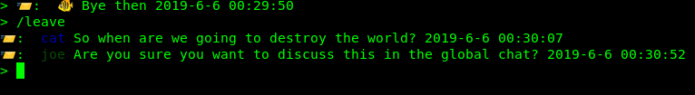

# TLS Chat

TLS-socket based client-server console chat application

## Overview

This is a symple console messanger written with using of NodeJS's built-in 'tls' module. It features global group chatting with 
all connected users and one-to-one private dialogoes. Can be used by members of small companies that communicate througs a local
network, by sysadmins who work on mainfraims with no GUI or just by cool oldschool guys who prefer console apps to ones with 
a user interface. 
The chat works by transering messages with TCP sockets, and using TLS above TCP makes private messaging more secure by preventing
MITM attacks. User accounts and messages are stored on the server side of the app, either in file system or in a database.

## Instalation

```bash
git clone https://github.com/MaryLynJuana/Chat
```

## Usage

To host the server on your computer:

```bash
node server.js
```

To enter the chat as a client:


```bash
node client.js
```

After you run the client file, you should enter your login and password.
If you are a new user, your account will be added to the database:


When you are logged in, you enter the global chat where ou can interact with all connected users:


When you receive a private message, you will get a notification.
To start a dialogue with somebody, you should type **'/dialogue @username'**.
You will see all the unread messages from that person and will be able to continue chatting in private:


To return to global chat, simply enter the **'/leave'** command:



If you want to close the app, you can either type **'/exit'** or press **Ctrl+C** on your keyboard. All your unread messages 
will be saved for the next time:


## Contributing

Pull request are welcome. Just please make sure you won't breack my code

## License

[MIT](https://choosealicense.com/licenses/mit/)
